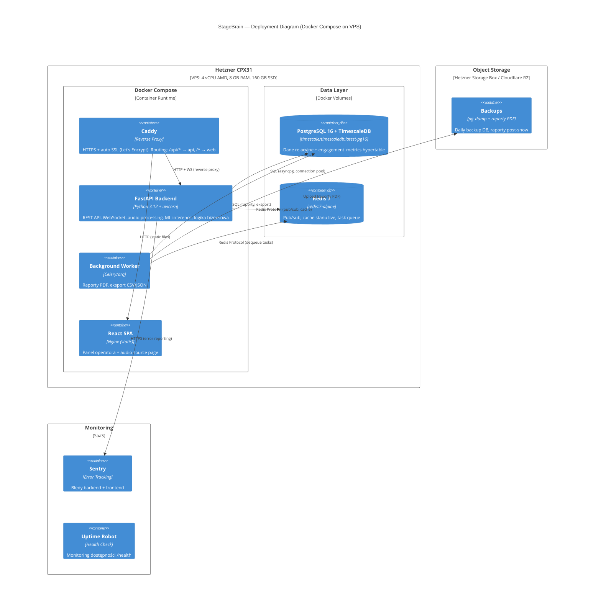

# C4 Deployment — Wdrożenie

**Status**: Active
**Ostatni przegląd**: 2026-02-18
**Właściciel**: Zespół architektury

---

Diagram wdrożenia przedstawia infrastrukturę StageBrain na VPS z Docker Compose.



## Strategia Wdrożenia

### CI/CD Pipeline (GitHub Actions)

```
1. Developer pushuje na `main`
2. GitHub Actions:
   a. Lint + testy (pytest, eslint, vitest)
   b. Build Docker images (api + web)
   c. Push do GitHub Container Registry (ghcr.io)
   d. SSH do VPS:
      - docker compose pull
      - docker compose up -d --remove-orphans
      - docker compose exec api alembic upgrade head
3. Health check: curl https://stagebrain.example.com/api/health
```

### Zmienne Środowiskowe

Zarządzane przez `.env` na VPS (nie w repo). Krytyczne sekrety:

| Zmienna | Opis |
|:---|:---|
| `DATABASE_URL` | Connection string PostgreSQL |
| `REDIS_URL` | Connection string Redis |
| `SECRET_KEY` | Klucz JWT / API key |
| `SENTRY_DSN` | Sentry error tracking DSN |
| `CORS_ORIGINS` | Dozwolone origins (domena frontendu) |

### Backup i Recovery

| Element | Strategia | Retencja |
|:---|:---|:---|
| **PostgreSQL** | Daily `pg_dump` → Object Storage | 7 daily + 4 weekly |
| **Redis** | Nie backupowany (cache, rebuild z DB) | — |
| **VPS** | Weekly snapshot | 2 snapshoty |
| **Docker volumes** | Pokryte przez pg_dump i VPS snapshot | — |

### Disaster Recovery

| Scenariusz | Procedura | RTO |
|:---|:---|:---|
| **Kontener padł** | Docker `restart: always` podnosi automatycznie | 2-5 sekund |
| **VPS restart** | Docker Compose auto-start po reboot | 1-2 minuty |
| **Uszkodzenie bazy** | Restore z pg_dump | 10-30 minut |
| **VPS utracony** | Nowy VPS + restore z backup + VPS snapshot | 1-2 godziny |

### Rollback

```bash
# Rollback do poprzedniej wersji
docker compose pull ghcr.io/org/stagebrain-api:<previous-tag>
docker compose up -d
# Jeśli migracja DB wymaga rollback:
docker compose exec api alembic downgrade -1
```

### Skalowanie (przyszłość)

Na MVP: jeden VPS, zero skalowania. Gdy potrzebne:

1. **Vertical scaling**: Większy VPS (8 vCPU, 16 GB RAM) — prostsze.
2. **Horizontal scaling**: Wiele instancji API za load balancerem + Redis pub/sub (architektura to wspiera).
3. **Managed services**: Przenieść PostgreSQL na managed DB (Hetzner Managed PostgreSQL), Redis na managed Redis.
