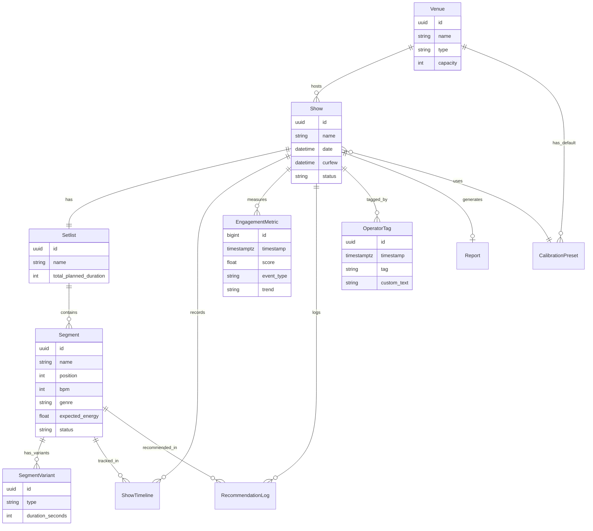

# Model Domenowy

**Status**: Active
**Ostatni przegląd**: 2026-02-18
**Właściciel**: Zespół architektury

---

Dokument opisuje główne encje biznesowe i ich relacje w systemie StageBrain. Pojęcia są zgodne ze [Słownikiem](../../00-start-here/glossary.md).

## Główne Encje

### 1. Venue (Obiekt koncertowy)

Miejsce, w którym odbywa się koncert. Przechowuje parametry kalibracji audio.

- **Atrybuty**: Nazwa, typ (hala/stadion/klub/open air), pojemność, domyślna kalibracja.
- **Relacje**:
  - Ma wiele koncertów (`shows`).
  - Ma powiązane presety kalibracji (`calibration_presets`).

### 2. Show (Koncert)

Konkretne wydarzenie muzyczne — centralna encja systemu.

- **Atrybuty**: Nazwa, data, czas startu, curfew, status, kalibracja venue.
- **Stany**: `setup` → `live` → `paused` → `ended`
- **Relacje**:
  - Należy do jednego venue.
  - Ma jedną setlistę.
  - Ma wiele engagement_metrics (time-series).
  - Ma wiele operator_tags.
  - Ma wiele recommendations_log.
  - Ma jeden opcjonalny raport post-show.

### 3. Setlist (Setlista)

Uporządkowana lista segmentów do zagrania podczas koncertu.

- **Atrybuty**: Nazwa, opis, łączny planowany czas.
- **Relacje**:
  - Należy do jednego show.
  - Ma wiele segmentów w określonej kolejności.

### 4. Segment (Utwór / Blok)

Pojedynczy element setlisty — utwór, blok, przerwa.

- **Atrybuty**: Nazwa, pozycja w setliście, BPM, gatunek, energia oczekiwana.
- **Stany**: `planned` → `active` → `completed` | `skipped`
- **Relacje**:
  - Należy do jednej setlisty.
  - Ma warianty (full/short) — minimum 1 wariant.
  - Ma wpisy w show_timeline (faktyczne czasy start/end).

### 5. Segment Variant (Wariant segmentu)

Wersja segmentu z określonym czasem trwania.

- **Atrybuty**: Typ (full/short), planowany czas trwania (sekundy), opis.
- **Relacje**:
  - Należy do jednego segmentu.

### 6. Show Timeline (Faktyczny przebieg)

Zapis faktycznych zdarzeń podczas koncertu — kiedy segment się rozpoczął, zakończył lub został pominięty.

- **Atrybuty**: Segment, wariant użyty, czas start, czas end, status (completed/skipped), delta vs plan.
- **Relacje**:
  - Należy do jednego show.
  - Odwołuje się do segmentu i wariantu.

### 7. Engagement Metric (Metryka zaangażowania)

Pojedynczy pomiar engagement score — generowany co 5-10 sekund z audio pipeline.

- **Atrybuty**: Timestamp, score (0-1), RMS energy, spectral centroid, ZCR, event_type (applause/cheering/silence...), event_confidence, trend (rising/falling/stable), raw_features (JSONB).
- **Przechowywanie**: TimescaleDB hypertable (partycjonowanie po czasie).
- **Relacje**:
  - Należy do jednego show.

### 8. Recommendation Log (Log rekomendacji)

Zapis rekomendacji systemu i decyzji operatora.

- **Atrybuty**: Timestamp, rekomendowane segmenty (ranking), uzasadnienie, decyzja operatora (accept/reject/ignore), segment wybrany.
- **Relacje**:
  - Należy do jednego show.
  - Odwołuje się do segmentów.

### 9. Operator Tag (Tag operatora)

Manualne oznaczenie kontekstowe od showcallera.

- **Atrybuty**: Timestamp, tag (preset lub custom), custom_text.
- **Predefiniowane tagi**: "problem techniczny", "energia spada", "publiczność szaleje", "zmiana planu", "extra".
- **Relacje**:
  - Należy do jednego show.

### 10. Calibration Preset (Preset kalibracji)

Zestaw parametrów kalibracji audio per typ venue / gatunek.

- **Atrybuty**: Nazwa, typ venue, pojemność (zakres), gatunek muzyczny, energy_baseline, energy_sensitivity, crowd_noise_floor, spectral_threshold.
- **Relacje**:
  - Może być powiązany z venue (domyślna kalibracja).
  - Używany przez show (kalibracja na konkretny koncert).

### 11. Report (Raport post-show)

Wygenerowany raport z przebiegu koncertu.

- **Atrybuty**: Typ (PDF/HTML), status (pending/generated/failed), ścieżka pliku, data generacji.
- **Relacje**:
  - Należy do jednego show.

---

## Diagram Relacji (ERD — Conceptual)



---

## Reguły Spójności

### Maszyna stanów — Show

```
setup ──► live ──► paused ──► live (resume)
  │         │                    │
  │         └──► ended ◄────────┘
  │
  └──► ended (cancel)
```

- `setup`: Konfiguracja pre-show (setlista, venue, kalibracja). Jedyny stan gdzie można edytować setlistę.
- `live`: Koncert trwa. Audio processing aktywny. Rekomendacje aktywne.
- `paused`: Tymczasowa pauza (np. przerwa techniczna). Audio processing zatrzymany. Timer wstrzymany.
- `ended`: Koncert zakończony. Dane zablokowane do edycji. Post-show analytics dostępny.

### Maszyna stanów — Segment

```
planned ──► active ──► completed
  │
  └──► skipped
```

- `planned`: W kolejce, jeszcze nie grany.
- `active`: Aktualnie grany (dokładnie 1 segment active w danym momencie).
- `completed`: Zagrany, z zapisanym faktycznym czasem.
- `skipped`: Pominięty (operator decyzja lub scenariusz odzysku czasu).

### Reguły biznesowe

1. **Jeden aktywny segment**: W danym momencie może być co najwyżej 1 segment w stanie `active`.
2. **Sekwencja segmentów**: Segment nie może przejść do `active` jeśli poprzedni jest jeszcze `active` (musi być `completed` lub `skipped`).
3. **Setlista read-only w live**: Po przejściu show do `live`, setlista nie może być modyfikowana (kolejność, dodawanie segmentów). Jedyne dozwolone operacje: start/end/skip segment, zmiana wariantu (full→short).
4. **Engagement metrics append-only**: Metryki nie mogą być modyfikowane ani usuwane (immutable time-series).
5. **Curfew immutable w live**: Po starcie show, curfew nie może być zmieniony (dane do prognoz muszą być stabilne).
