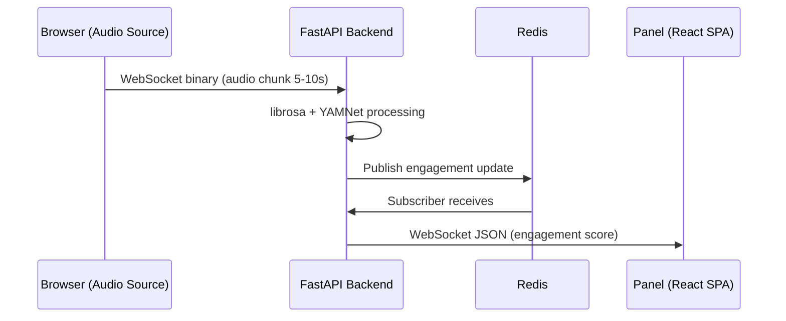

# Diagramy Sekwencji (Sequence Diagrams)

**Status**: Active
**Ostatni przegląd**: 2026-02-18

---

Diagramy sekwencji opisują kluczowe przepływy danych i interakcje między komponentami systemu StageBrain.

## Struktura Katalogów

- [Audio Pipeline](./audio-pipeline/README.md) — Ingest audio, feature extraction, engagement scoring.
- [Live Show](./live-show/README.md) — Setup show, zarządzanie segmentami, kontrola czasu, scenariusze odzysku.
- [Recommendations](./recommendations/README.md) — ML ranking, rekomendacje, post-show analytics.

## Konwencje

1. **Technologia**: Mermaid.js osadzony w blokach kodu Markdown.
2. **Lokalizacja**: Diagramy w podkatalogu odpowiedniej domeny.
3. **Nazewnictwo**: `kebab-case.md` (np. `01-audio-ingest-process.md`).

## Przykład

