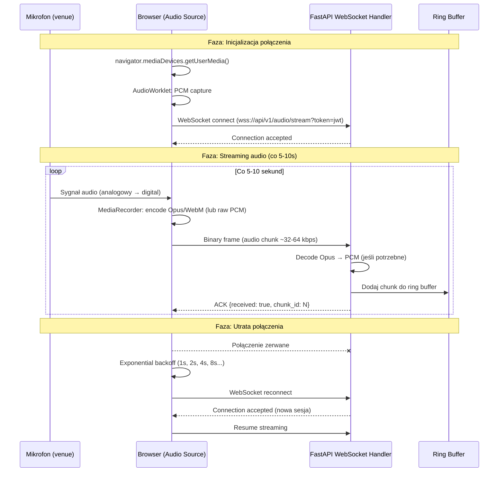

# Audio Ingest — Przepływ

**Status**: Active
**Ostatni przegląd**: 2026-02-18

---

## Opis

Proces przechwytywania audio z mikrofonu na venue i przesyłania do backendu przez WebSocket. Audio Source to strona przeglądarkowa (Chrome) na laptopie technika audio.

## Diagram

## Szczegóły techniczne

### Format audio

| Parametr | Wartość |
|:---|:---|
| Sampling rate | 16 kHz |
| Bit depth | 16-bit |
| Channels | Mono |
| Codec (z przeglądarki) | Opus/WebM (MediaRecorder) |
| Codec (po decode na serwerze) | PCM 16-bit |
| Bitrate | ~32 kbps (PCM) / ~64 kbps (Opus) |
| Chunk size | 5-10 sekund |

### Ring Buffer

- In-memory circular buffer na serwerze.
- Przechowuje ostatnie N okien (np. 6 okien × 10s = 60s).
- Starsze dane nadpisywane (nie potrzebujemy surowego audio z przed 60s).
- Audio processing czyta z buffora — nie blokuje ingestu.

### Reconnect

- Klient: exponential backoff (1s → max 30s).
- Po reconnect: streaming wznawia od aktualnego momentu (nie odtwarza buffora).
- Panel wyświetla status: `LIVE` / `RECONNECTING` / `OFFLINE`.
