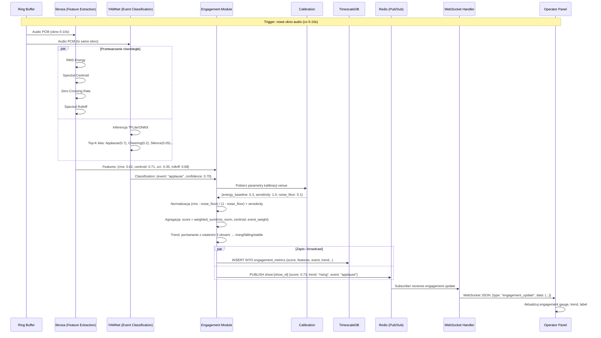

# Engagement Scoring — Przepływ

**Status**: Active
**Ostatni przegląd**: 2026-02-18

---

## Opis

Proces przetwarzania audio z ring buffer, obliczania engagement score, zapisu do bazy i broadcast do panelu operatora. Wykonywany co 5-10 sekund (przy każdym nowym oknie audio).

## Diagram



## Szczegóły techniczne

### Czas przetwarzania (budżet latencji)

| Etap | Czas |
|:---|:---|
| librosa features | ~50-100 ms |
| YAMNet inference (TFLite) | ~100-200 ms |
| Agregacja + normalizacja | ~1 ms |
| Zapis do DB | ~5-10 ms |
| Redis publish | ~0.1 ms |
| WebSocket broadcast | ~1 ms |
| **Łącznie** | **~160-320 ms** |

Budżet: 5000-10000 ms (interwał okna). Zużywamy ~3-6% budżetu. Komfortowy zapas.

### Przetwarzanie równoległe

librosa i YAMNet procesowane w `ProcessPoolExecutor` (osobne procesy — omijają GIL). Ring buffer obsługuje concurrent read.

### Trend calculation

```python
def calculate_trend(current_score, last_3_scores):
    if len(last_3_scores) < 2:
        return "stable"
    avg_recent = mean(last_3_scores)
    if current_score > avg_recent + 0.05:
        return "rising"
    elif current_score < avg_recent - 0.05:
        return "falling"
    return "stable"
```

### Fallback (brak YAMNet)

Jeśli YAMNet inference zawodzi (timeout, error):
- Engagement score obliczany tylko z librosa features.
- `event_type` = `null`, `event_confidence` = 0.
- Log warning do Sentry.
- System działa dalej — score jest mniej precyzyjny, ale dostępny.
