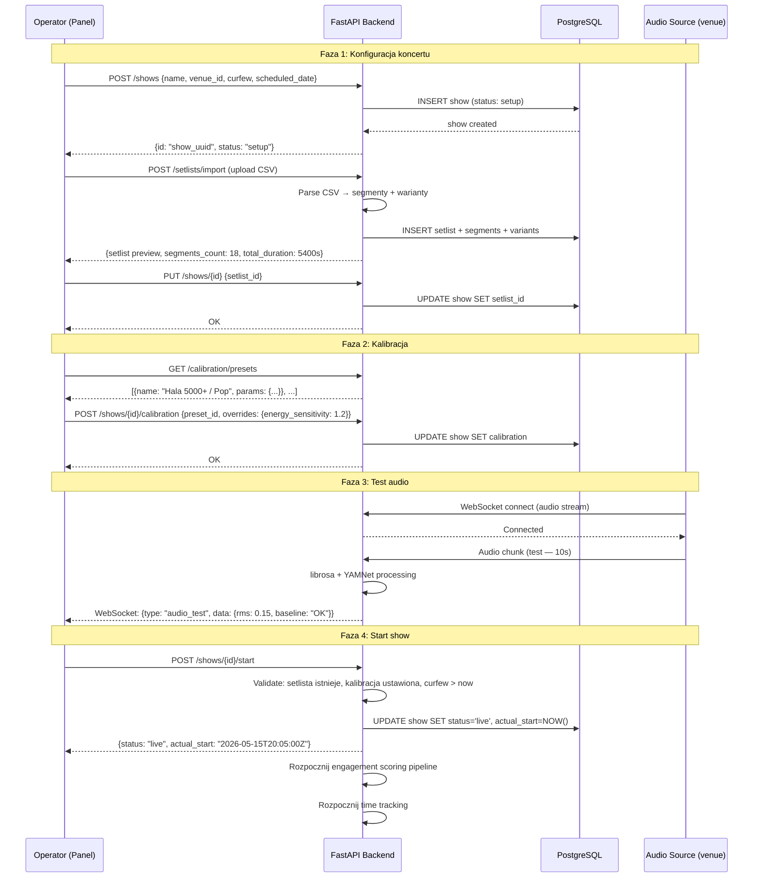

# Show Setup — Przepływ

**Status**: Active
**Ostatni przegląd**: 2026-02-18

---

## Opis

Proces konfiguracji koncertu przed show: tworzenie/import setlisty, wybór venue i kalibracji, ustawienie curfew, test audio. Show przechodzi ze stanu `setup` do `live`.

## Diagram

## Walidacje przy starcie show

| Warunek | Błąd jeśli nie spełniony |
|:---|:---|
| Show ma setlistę | 400: "Setlist required before starting show" |
| Setlista ma ≥1 segment | 400: "Setlist must have at least one segment" |
| Curfew jest w przyszłości | 400: "Curfew must be in the future" |
| Show jest w stanie `setup` | 409: "Show already started" |
| Audio source podłączony | Warning (nie blokuje startu) |
