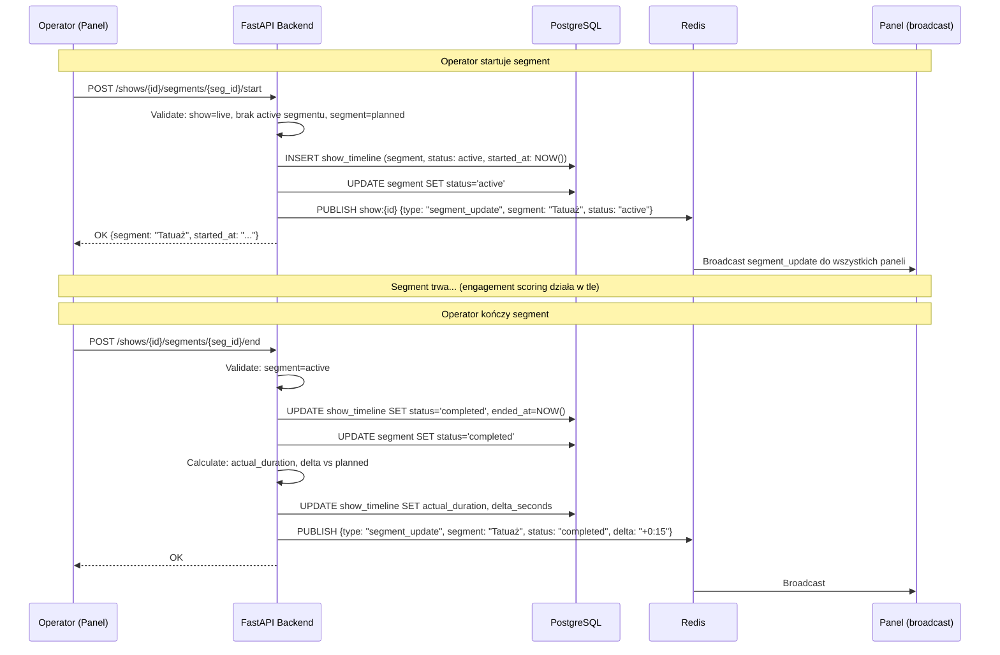
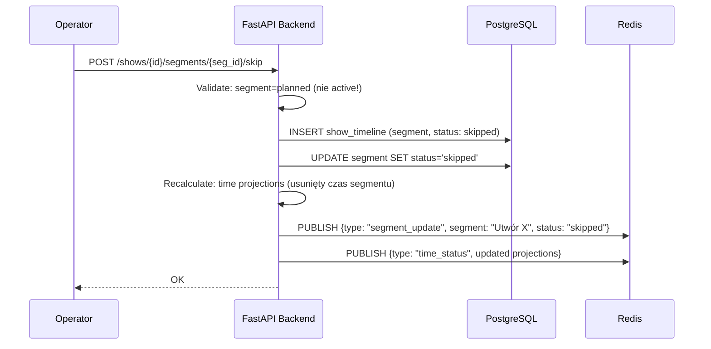
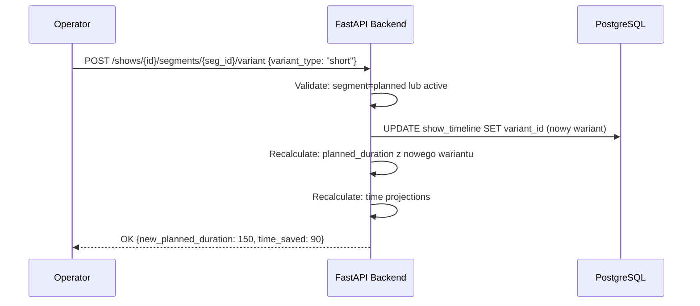

# Segment Lifecycle — Przepływ

**Status**: Active
**Ostatni przegląd**: 2026-02-18

---

## Opis

Zarządzanie segmentami podczas koncertu: start, end, skip, zmiana wariantu. Operator kontroluje przebieg show przez panel lub WebSocket.

## Diagram — Start / End Segment

## Diagram — Skip Segment

## Diagram — Zmiana Wariantu

## Reguły biznesowe

| Reguła | Szczegóły |
|:---|:---|
| Max 1 active segment | Nie można startować segmentu gdy inny jest active |
| Skip tylko planned | Nie można pominąć active segmentu (trzeba go najpierw zakończyć) |
| Zmiana wariantu: planned lub active | Zmiana z full→short możliwa nawet w trakcie grania (wpływa na oczekiwany czas) |
| Po end/skip: auto-recalculate time | Każda zmiana statusu segmentu triggeruje przeliczenie prognoz czasowych |
