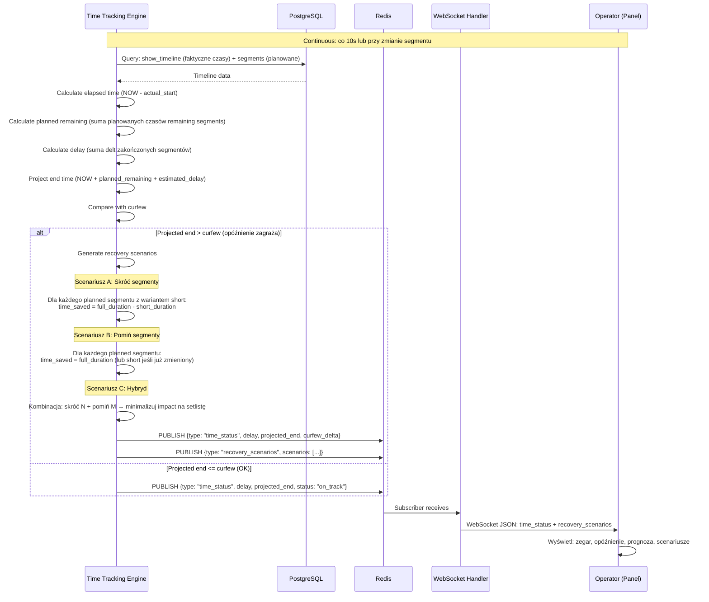
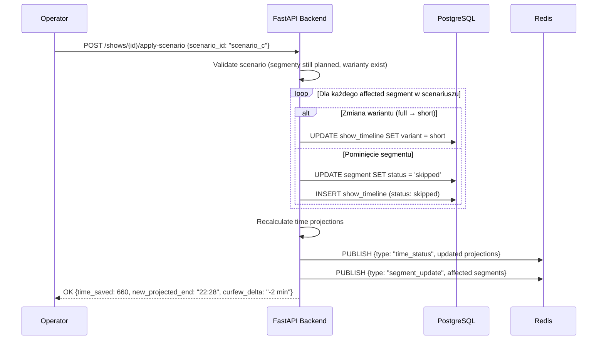

# Time Recovery — Przepływ

**Status**: Active
**Ostatni przegląd**: 2026-02-18

---

## Opis

Kontrola czasu podczas koncertu: monitoring opóźnień, prognoza curfew, automatyczne generowanie scenariuszy odzysku czasu. System proaktywnie informuje operatora o zagrożeniu przekroczenia curfew.

## Diagram — Monitoring i Scenariusze



## Diagram — Zastosowanie Scenariusza



## Logika generowania scenariuszy

### Algorytm

```python
def generate_recovery_scenarios(show, remaining_segments, delay_seconds):
    scenarios = []

    # Scenariusz A: Skróć segmenty (greedy — od największego oszczędzenia)
    shortable = [s for s in remaining_segments if s.has_variant("short") and s.current_variant == "full"]
    shortable.sort(key=lambda s: s.full_duration - s.short_duration, reverse=True)
    scenario_a = build_shorten_scenario(shortable, delay_seconds)
    if scenario_a.time_saved > 0:
        scenarios.append(scenario_a)

    # Scenariusz B: Pomiń segmenty (od najniższego expected_energy / najkrótszego)
    skippable = [s for s in remaining_segments if s.status == "planned"]
    skippable.sort(key=lambda s: s.expected_energy)  # pomiń najmniej energetyczne
    scenario_b = build_skip_scenario(skippable, delay_seconds)
    if scenario_b.time_saved > 0:
        scenarios.append(scenario_b)

    # Scenariusz C: Hybryd (skróć co się da, potem pomiń)
    scenario_c = build_hybrid_scenario(shortable, skippable, delay_seconds)
    if scenario_c.time_saved > 0:
        scenarios.append(scenario_c)

    return scenarios
```

### Priorytety

1. **Skracanie** (mniejszy impact na show) ma priorytet nad **pomijaniem**.
2. Pomijanie sortowane po `expected_energy` — najpierw pomijamy segmenty o najniższej oczekiwanej energii (najmniej stracona wartość).
3. Scenariusze generowane tylko gdy `projected_end > curfew` (nie spamujemy operatora gdy jest on track).

### Threshold

- Scenariusze generowane od `delay > 60 sekund`.
- Alert (visual cue w panelu) od `delay > 180 sekund` lub `projected_end > curfew`.
