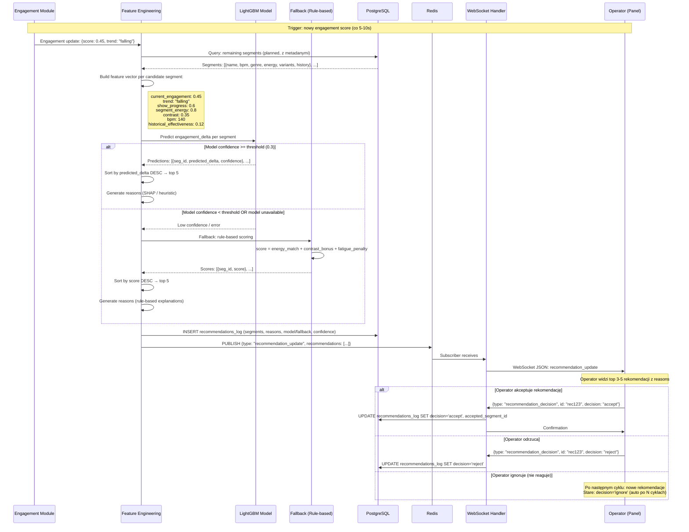

# ML Recommendation — Przepływ

**Status**: Active
**Ostatni przegląd**: 2026-02-18

---

## Opis

Generowanie rekomendacji następnego segmentu do zagrania. System oblicza ranking top 3-5 segmentów przy każdej zmianie engagement score, z użyciem modelu LightGBM lub fallbacku regułowego. Operator akceptuje, odrzuca lub ignoruje rekomendację.

## Diagram

## Szczegóły techniczne

### Feature Engineering — pełna lista

| Feature | Typ | Źródło | Opis |
|:---|:---|:---|:---|
| `current_engagement` | float | Engagement Module | Aktualny score (0-1) |
| `engagement_trend` | cat | Engagement Module | rising / falling / stable |
| `show_progress` | float | Time Tracking | % show za nami (0-1) |
| `segment_energy` | float | Segment metadata | Oczekiwana energia (0-1) |
| `segment_bpm` | int | Segment metadata | Tempo |
| `segment_genre` | cat | Segment metadata | Gatunek (encoded) |
| `segment_duration` | int | Segment variant | Czas trwania (sekundy) |
| `segment_variant` | cat | Current variant | full / short |
| `contrast_vs_previous` | float | Calculated | abs(segment.energy - previous.energy) |
| `historical_effectiveness` | float | DB (past shows) | Średnia engagement_delta po zagraniu |
| `times_played` | int | DB (past shows) | Ile razy segment był grany |
| `time_remaining_ratio` | float | Time Tracking | Remaining time / total planned |

### Reasons (wyjaśnienia)

Każda rekomendacja zawiera `reason` — krótki tekst wyjaśniający:

| Sytuacja | Example reason |
|:---|:---|
| Engagement spada, rekomendowany energetyczny | "Energia spada — wysoka energia segmentu (+0.35 kontrast)" |
| Wysoki kontrast | "Duży kontrast vs poprzedni segment (wolny → szybki)" |
| Historycznie skuteczny | "Historycznie podnosi engagement o +12% w podobnych warunkach" |
| Fallback regułowy | "Rekomendacja regułowa — dobra kompatybilność z aktualnym poziomem energii" |

### Cykl rekomendacji

- Nowe rekomendacje generowane **przy każdym engagement update** (co 5-10s).
- Ranking się zmienia dynamicznie — jeśli engagement rośnie, rekomendacje mogą się zmienić.
- Po akceptacji/odrzuceniu: zaakceptowany segment usunięty z listy kandydatów w następnym cyklu.
