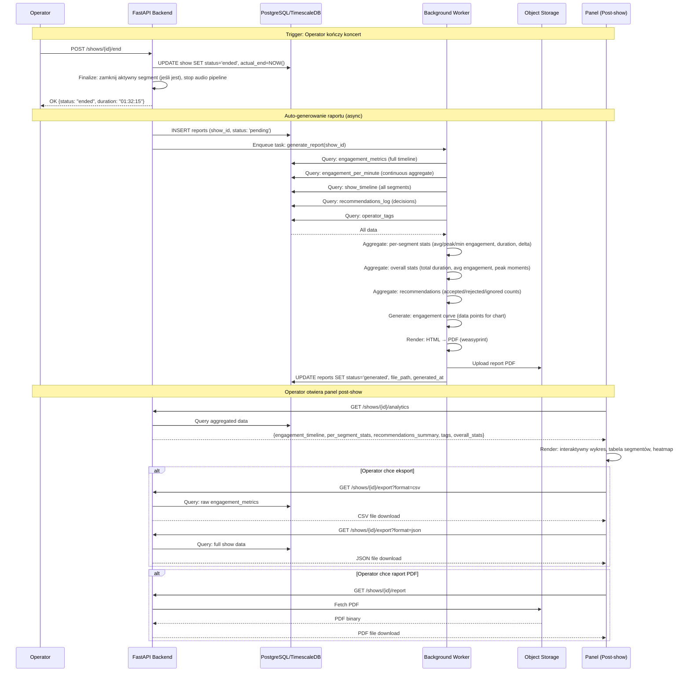

# Post-Show Analytics — Przepływ

**Status**: Active
**Ostatni przegląd**: 2026-02-18

---

## Opis

Analiza po zakończeniu koncertu: agregacja danych, generowanie raportu, eksport. Trigger: operator kończy show (status → `ended`).

## Diagram



## Analytics Response — Struktura

```json
{
  "show": {
    "id": "uuid",
    "name": "Quebonafide — Warszawa",
    "venue": "COS Torwar",
    "date": "2026-05-15",
    "duration_seconds": 5535,
    "curfew_delta_seconds": -165
  },
  "overall": {
    "avg_engagement": 0.64,
    "peak_engagement": 0.95,
    "peak_moment": "2026-05-15T21:15:30Z",
    "lowest_engagement": 0.22,
    "lowest_moment": "2026-05-15T21:45:10Z",
    "total_segments": 18,
    "segments_completed": 16,
    "segments_skipped": 2,
    "total_delay_seconds": 195,
    "tags_count": 7
  },
  "engagement_timeline": [
    {"timestamp": "2026-05-15T20:05:00Z", "score": 0.55, "event": "cheering"},
    {"timestamp": "2026-05-15T20:05:10Z", "score": 0.58, "event": "cheering"}
  ],
  "per_segment": [
    {
      "name": "Tatuaż",
      "position": 1,
      "variant_used": "full",
      "planned_duration": 240,
      "actual_duration": 255,
      "delta": 15,
      "avg_engagement": 0.72,
      "peak_engagement": 0.89,
      "dominant_event": "cheering"
    }
  ],
  "recommendations_summary": {
    "total": 42,
    "accepted": 8,
    "rejected": 5,
    "ignored": 29,
    "fallback_used": 12
  },
  "tags": [
    {"timestamp": "2026-05-15T21:12:00Z", "tag": "energy_drop", "custom_text": null},
    {"timestamp": "2026-05-15T21:30:00Z", "tag": "tech_problem", "custom_text": "Mikrofon artysty"}
  ]
}
```

## Eksport — Formaty

### CSV (surowe metryki)

Kolumny: `timestamp, score, rms_energy, spectral_centroid, zcr, event_type, event_confidence, trend`

Jeden wiersz per pomiar (co 5-10s). Dla 90-min show: ~540-1080 wierszy.

### JSON (pełne dane)

Pełna struktura `analytics response` + surowe metryki. Przydatne do dalszej analizy w Python/Jupyter.

### PDF (raport automatyczny)

Sekcje raportu:
1. **Podsumowanie** — nazwa, venue, data, czas trwania, kluczowe metryki.
2. **Engagement Timeline** — wykres engagement w czasie (z zaznaczonymi segmentami i tagami).
3. **Tabela Segmentów** — per-segment stats (czas planowany vs faktyczny, engagement, delta).
4. **Rekomendacje** — ile zaakceptowanych/odrzuconych, najlepsze i najgorsze rekomendacje.
5. **Tagi operatora** — lista z timestamps.
6. **Wnioski** — peak moments, low moments, anomalie.
